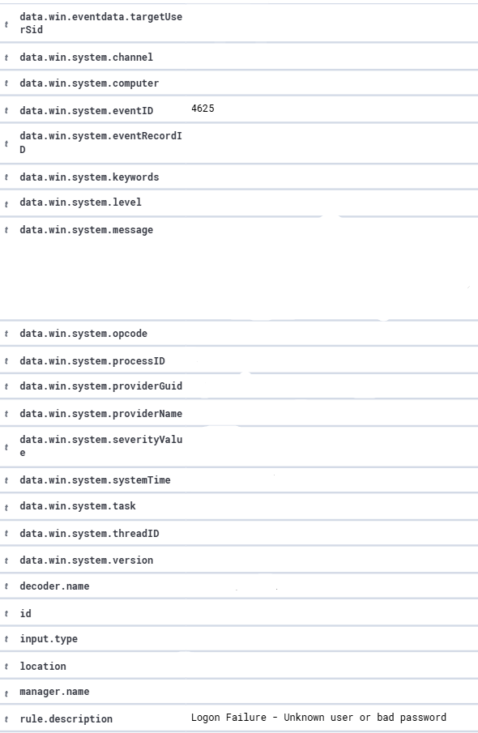
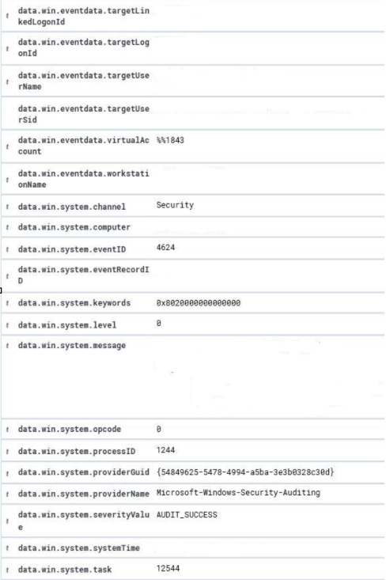
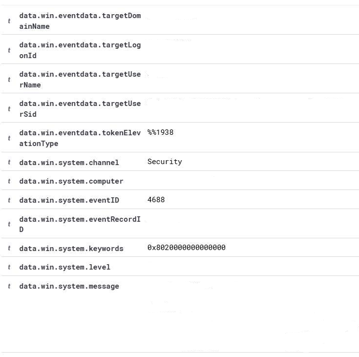

# Wazuh Security Event Investigations

This section documents security event investigations performed in the Wazuh SOC home lab.

## Investigations

### Event ID 4625 – Failed Logon

- Event ID: 4625
- Description: Failed authentication attempt
- Investigation focus:
  - Username
  - Timestamp
  - Logon Type
  - Failure Reason
  - Source IP, when available
  - Related authentication events

### Investigation Finding

The event represented a failed authentication attempt. The available event details were reviewed including Logon Type, failure reason, username, timestamp, and source IP when available.

The event was treated as an investigation lead rather than automatically classified as an attack. Additional related authentication events would be correlated before determining whether repeated failures indicate suspicious activity.
---

### Event ID 4624 – Successful Logon

- Event ID: 4624
- Description: Successful authentication
- Investigation focus:
  - Username
  - Timestamp
  - Logon Type
  - Authentication details
  - Related events

### Investigation Finding

The event represented a successful authentication. Logon Type and authentication details were reviewed and correlated with surrounding activity.

A successful logon alone was not treated as malicious. Context and related events were considered during investigation.
---

### Event ID 4688 – Process Creation

- Event ID: 4688
- Description: New process creation
- Investigation focus:
  - New Process Name
  - Parent Process
  - Process ID
  - Command Line, when available
  - User context
  - Related network activity

### Investigation Finding

The event represented a new process creation. The process name, parent process, process ID, command line when available, and user context were reviewed.

Process creation activity was evaluated using process context and related events rather than treating the event alone as malicious.
## Investigation Approach

Alert → Validate → Collect Evidence → Correlate → Build Timeline → Investigate → Document Findings
